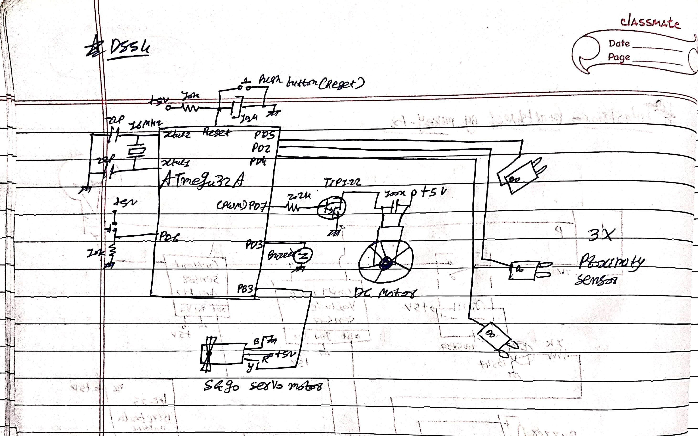
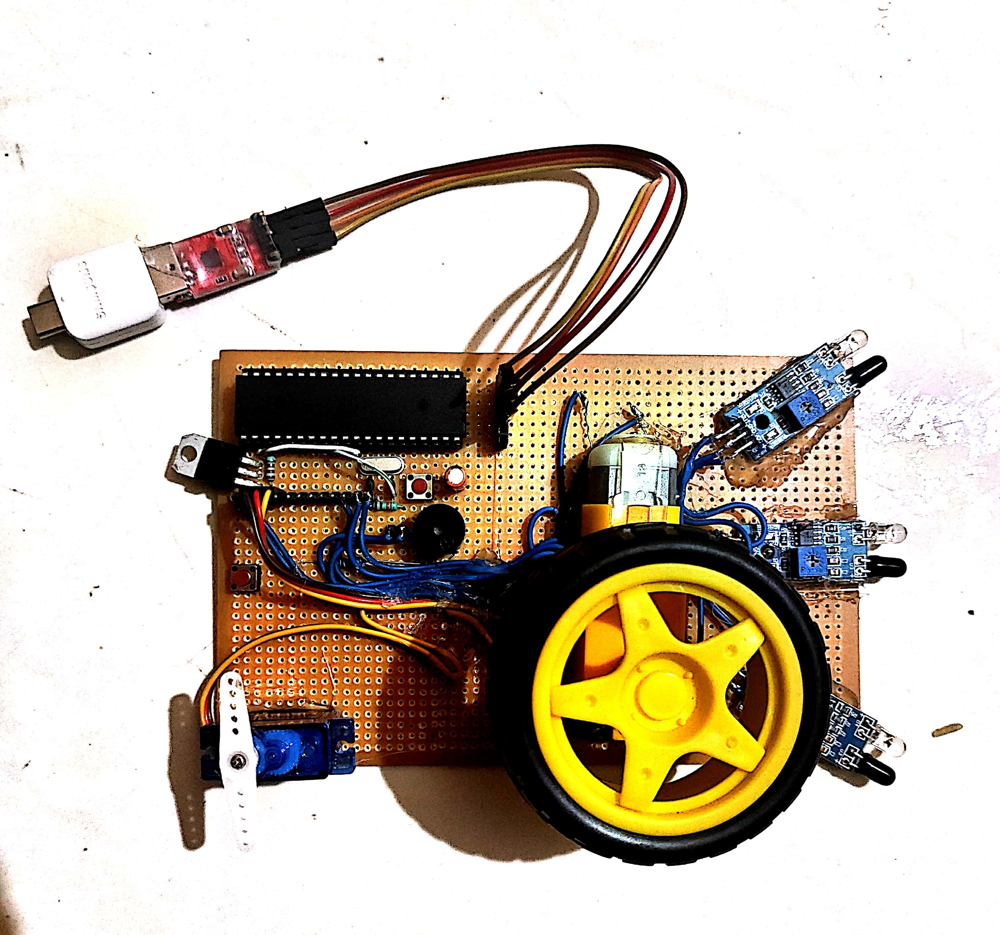

# 🚘 DSS4: Driver Safety System & Smart Cockpit


**DSS4** (Driver Safety System 4) is a real-time Advanced Driver Assistance System (ADAS) that integrates zero-latency AI drowsiness detection with a physical, autonomous microcontroller fail-safe. 

When the system detects the driver falling asleep, an ATmega32A microcontroller physically seizes control of the vehicle's throttle, braking, and steering, utilizing a 3-zone radar system to safely evade traffic until the driver regains consciousness.

## 🌟 Key Features
* **Zero-Latency AI Eye Tracking:** Uses Google MediaPipe to calculate the Eye Aspect Ratio (EAR) locally, ensuring instant reaction times without cloud latency.
* **Triple-Zone Radar Evasion:** Utilizes Left, Center, and Right proximity sensors to dynamically steer away from obstacles when in Autopilot mode.
* **Anti-Brownout Soft-Start:** Features a custom C++ PWM acceleration curve to prevent massive stall-current spikes from crashing the microcontroller's power rail.
* **Responsive Web Cockpit:** A Flask-based HUD showing live video feeds, triple-radar telemetry, EAR math, and interactive controls for manual driving via a laptop or mobile device.
* **Closed-Loop Heartbeat Monitor:** The Python backend continuously monitors the ATmega32A's serial stream, immediately flagging hardware disconnects.

---

## 🛠️ Hardware Requirements
* **Microcontroller:** Bare ATmega32A (running external 16MHz Crystal).
* **Programmer:** USBasp (for flashing MightyCore bootloader).
* **Serial Interface:** CH9102 USB-to-TTL Converter.
* **Actuators:** SG90 Servo Motor (Steering), DC Motor driven by BC547 Transistor (Wheels).
* **Sensors:** 3x IR Proximity Sensors, 5V Active Buzzer, Push Button.

---

## 🔌 Circuit & Pin Configuration

> **Note:** The layout is highly optimized, keeping all primary control lines grouped on the ATmega32A's `PORTD` register for clean breadboard routing.






**ATmega32A Pin Mapping (MightyCore Standard):**
* `Pin 15 (PD7)` ➔ DC Motor (via BC547 Base resistor) - *True Hardware PWM*
* `Pin 3 (PB3)`  ➔ SG90 Servo Motor (Signal/Yellow wire)
* `Pin 10 (PD2)` ➔ Center IR Sensor (Controls Braking/Speed)
* `Pin 11 (PD3)` ➔ Buzzer (+) (Wake-up Alarm)
* `Pin 12 (PD4)` ➔ Right IR Sensor (Triggers Left Turn)
* `Pin 13 (PD5)` ➔ Left IR Sensor (Triggers Right Turn)
* `Pin 14 (PD6)` ➔ Push Button (to GND) - *Manual Takeover*
* `Pin 14 (RXD)` ➔ CH9102 **TXD** (Crossover connection)
* `Pin 15 (TXD)` ➔ CH9102 **RXD** (Crossover connection)

---

## ⚙️ Hardware Setup: The Bootloader (JP3 Jumper)

Brand new ATmega32A chips run at an internal 1MHz clock. You must burn the bootloader to unlock the 16MHz external crystal.

1. Install [MightyCore](https://github.com/MCUdude/MightyCore) in the Arduino IDE.
2. Connect your **USBasp** to the ATmega32A (MOSI, MISO, SCK, RESET, VCC, GND).
3. ⚠️ **CRITICAL:** Short the **JP3 Jumper** on the USBasp. This enables "Slow SCK" mode, which is required to talk to a factory 1MHz chip.
4. In Arduino IDE: Select `Board: ATmega32`, `Clock: 16 MHz external`.
5. Click **Tools > Burn Bootloader**. 
6. **Remove the JP3 Jumper** (the chip is now running at 16MHz). You can now upload the main `arduino_code.ino` file via the programmer.

---

## 💻 Software Installation

This project isolates its dependencies in a virtual environment to prevent version conflicts (especially with MediaPipe).

1. Clone the repository:
```bash
   git clone [https://github.com/mikey-7x/DSS4-Driver-Safety-System.git](https://github.com/mikey-7x/DSS4-Driver-Safety-System.git)
   cd DSS4-Driver-Safety-System
```
 2. Create and activate a virtual environment:
   * **Windows:**
     ```powershell
     python -m venv .venv
     .\.venv\Scripts\activate
     ```
     ```
   * **Linux/macOS:**
     ```bash
     python3 -m venv .venv
     source .venv/bin/activate
     ```
 3. Install the exact required libraries:
   ```powershell
   python -m pip install -r requirements.txt
   ```
## 🚀 Running the System
### Configuration
Open dss_cockpit.py and verify your hardware ports:
```python
COM_PORT = "COM3"  # Check Windows Device Manager for CH9102 port
BAUD_RATE = 9600
camera_source = 0  # '0' for internal laptop webcam, or use an IP Webcam URL
```
### Execution
 1. Connect the **CH9102** to your laptop (Ensure TX ➔ RX crossover).
 2. Run the Python server:
   ```powershell
   python dss_cockpit.py
   ```
 3. Open a modern web browser to: http://127.0.0.1:5000
### 🎮 Dashboard Operation
 * **START SYSTEM:** Initializes ADAS. The ATmega32A will soft-start the DC motor to a safe cruising PWM.
 * **GAS / BRAKE:** Manual PWM overrides.
 * **FULLY MANUAL:** Disables the AI eye-tracking loop to save CPU power, locking the hardware in 100% driver-controlled mode.
## ⚠️ Troubleshooting
 * **GUI Buttons Unresponsive / MCU OFFLINE:** The system is closed-loop. If your TX/RX wires are not properly crossed over between the CH9102 and the ATmega32A, the GUI will not update state.
 * **AttributeError: module 'mediapipe' has no attribute 'solutions':** You have a modern, incompatible version of MediaPipe. You *must* install mediapipe==0.10.9 as defined in the requirements.
 * **Motor doesn't spin / Chip Restarts:** Ensure you are using the Soft-Start C++ logic. If the motor still stalls, your BC547 transistor may be thermally overloaded (max 100mA). Upgrade to a TIP120 or L298N module.
## 👨‍💻 Author
**Mikey-7x** * GitHub: @mikey-7x
 * Profile: Practical Electronics Engineer specializing in Analog Design, High-Power Circuitry, and Microcontroller/AI Integration.
## 📄 License
This project is open-source and available under the MIT License.

